## Projeto Final SCTEC Módulo 01 - Hicaro Calliari Bottenberg - ANÁLISE DE DADOS T2

Projeto de Análise de Dados desenvolvido com o objetivo de aplicar, na prática, os conhecimentos adquiridos na construção de um pipeline de dados completo (ETL) e na implementação da Arquitetura Medallion, utilizando as camadas Raw, Silver e Gold com Python e SQL.

O projeto contempla todas as etapas do fluxo de dados, desde a extração e ingestão dos dados brutos até o tratamento, transformação, modelagem e geração de análises estratégicas para apoio à tomada de decisão.

Foi utilizada uma base de dados real, disponibilizada para download pelo portal do Senai, composta por informações provenientes de quatro tabelas do Portal da Transparência. Os dados inicialmente desestruturados passaram por processos de limpeza, padronização, integração e organização, resultando em uma estrutura analítica preparada para consultas e geração de indicadores.

## OBJETIVO

* Baixar os dados de Viagens a Serviço direto da fonte oficial, sem intervenção manual;
* Preservar o dado original fielmente na camada Raw, garantindo rastreabilidade e auditoria de qualquer transformação futura;
* Limpar e organiza os dados na camada Silver, com tipagem correta e integridade referencial entre as tabelas , eliminando inconsistências, duplicidades e erros de formato;
* Responder perguntas de negócio reais na camada Gold, tudo isso apoiado por métricas e gráficos que tornam a informação acessível para quem for tomar decisões.

## Qual problema resolve?

Este projeto resolve o desafio de transformar dados públicos brutos em informações estruturadas e confiáveis para análise, através da construção de um pipeline de dados organizado em camadas.

O pipeline permite:

- Realizar a ingestão dos dados para a camada Bronze (`Raw`), preservando os dados originais e garantindo rastreabilidade para auditoria e futuras análises;
- Estruturar e padronizar os dados na camada Silver, realizando tratamentos de tipos, conversões, validações e relacionamentos entre tabelas através de chaves primárias e estrangeiras;
- Manter os dados tratados em uma estrutura analítica confiável, servindo como base para a criação dos indicadores e análises da camada Gold;
- Criar tabelas analíticas e views para disponibilizar informações de negócio de forma simplificada, reutilizável e otimizada para consultas.
  

## Tecnologias Utilizadas
- Python
- Pandas
- Matplotlib
- Jupyter Notebook
- Banco de dados Mysql

## Como Executar o Projeto

```text
1º Clone o repositório através da URL:
    https://github.com/hicarocalliari/Projeto_final_SCTEC.git

2º Acesse a pasta do projeto e navegue até o diretório:
    Projeto_final_SCTEC

3º Crie e ative o ambiente virtual (venv):

    Linux:
        python3 -m venv venv
        source venv/bin/activate

    Windows (Prompt de Comando):
        python -m venv venv
        venv\Scripts\activate

4º Instale as dependências necessárias executando o comando:

    pip install -r requirements.txt

    O arquivo requirements.txt contém todos os pacotes necessários para execução do projeto, como pandas, matplotlib e demais bibliotecas utilizadas.

5º No arquivo "env.example"

    Edite o campo MYSQL_PASSWORD=sua_senha_aqui
    Renomeie o arquivo para .env
    Salve a Alteração

6º Crie o banco de dados no mysql Workbench 
    Na pasta sql/ddl , você encontrará o arquivo "criar_banco.sql", que possuí todas as estruturas das tabelas necessárias
  
7º Rode os arquivos na seguinte ordem:
    1ª - extrair.py
    2ª - transformar.py
    3ª - analise.ipynb
    
```

## Estrutura do projeto
```text
├── data
│   └── viagens_2025_6meses.zip
├── database
│   ├── banco.py
│   ├── config.py
│   └── __pycache__
├── img
│   ├── graficos
├── notebooks
│   └── analise.ipynb
├── README.md
├── requirements.txt
├── scripts
│   ├── extrair.py
│   ├── __pycache__
│   └── transformar.py
├── sql
    ├── ddl
    ├── gold
    └── silver
```

## Estrutura da Camada Bronze
### Composta pelas tabelas Raw, responsáveis pela ingestão dos dados originais provenientes da fonte oficial, mantendo sua estrutura inicial e garantindo a rastreabilidade das informações.

| **Tabela** | **Linhas carregadas** |
|---|---|
| raw_viagem | 341860 linhas  |
| raw_pagamento | 606916 linhas |
| raw_passagem | 167260 linhas |
| raw_trecho | 763349 linhas |


## Estrutura da Camada Silver
### Baseada nos dados da camada Bronze, aplicando tipagem correta, tratamento, padronização e enriquecimento das tabelas com novas informações relevantes.

| **Transformação Raw → Silver** | **Resultado** |
|---|---|
| Chaves primárias | Criadas chaves primárias nas tabelas Silver (`id_viagem`, `id_passagem`, `id_pagamento` e `id_trecho`) |
| Chaves estrangeiras | Criados relacionamentos entre tabelas através de `id_viagem` referenciando `silver_viagem` |
| Coluna `valor_total` | Nova coluna criada em `silver_viagem`, calculada a partir dos valores de diárias, passagens, devolução e outros gastos |
| Coluna `duracao_dias` | Nova coluna criada em `silver_viagem`, calculada a partir das datas de início e fim da viagem |
| Tipos de dados | Conversão de campos `VARCHAR` da Raw para tipos adequados na Silver (`DATE`, `DECIMAL` e `INT`) |
| Campos monetários | Conversão dos valores financeiros de `VARCHAR` para `DECIMAL(10,2)` |
| Datas | Conversão dos campos de data de `VARCHAR` para `DATE` |
| Restrições NOT NULL | Adicionada obrigatoriedade em campos essenciais (`id_viagem`, `nome_orgao_superior` e `tipo_pagamento`) |
| Constraints CHECK | Criadas validações para impedir valores negativos em campos financeiros e quantidade de diárias |
| Identificadores automáticos | Criados campos `AUTO_INCREMENT` para `id_passagem`, `id_pagamento` e `id_trecho` |
| Unicidade dos trechos | Criada constraint UNIQUE para evitar duplicidade de sequência de trechos por viagem (`id_viagem`, `sequencia_trecho`) |
| Normalização dos dados | Separação das informações em tabelas de viagem, passagem, pagamento e trecho |


## Perguntas a serem respondidas:
1. Os 5 órgãos com maior custo total?
2. Os 3 destinos com maior custo médio por viagem?
3. A viagem de maior duração e seu custo total?
4. Qual o tipo de pagamento com maior valor médio?
5. Qual o meio de transporte mais usado nos trechos?
6. Qual UF de destino aparece em mais trechos?
7. Qual órgão pagou mais no total?

# Respostas:

## 1. Os 5 órgãos com maior custo total?

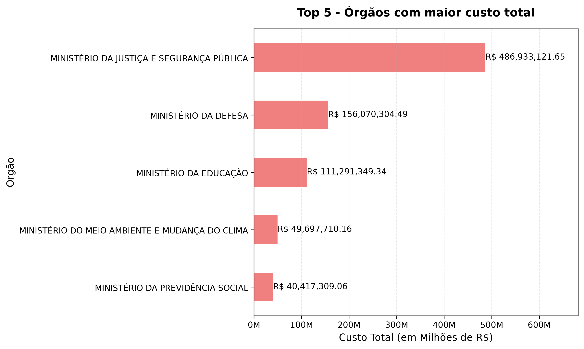

Realizando uma consulta SQL utilizando os dados tratados e organizados da tabela silver_viagem, foi realizada a soma da coluna valor_total para identificar o custo total. O resultado obtido foi utilizado para a criação do gráfico apresentado acima, além da geração de um DataFrame para facilitar a visualização e análise dos valores calculados.

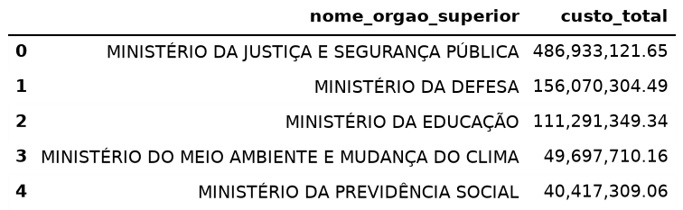

## 2. Os 3 destinos com maior custo médio por viagem?
   
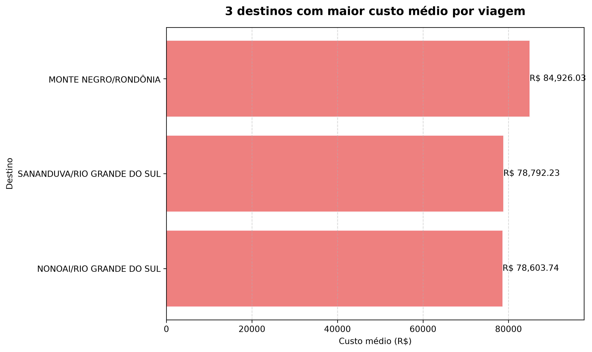

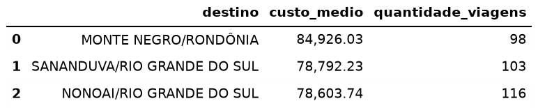

## 3. A viagem de maior duração e seu custo total?
   
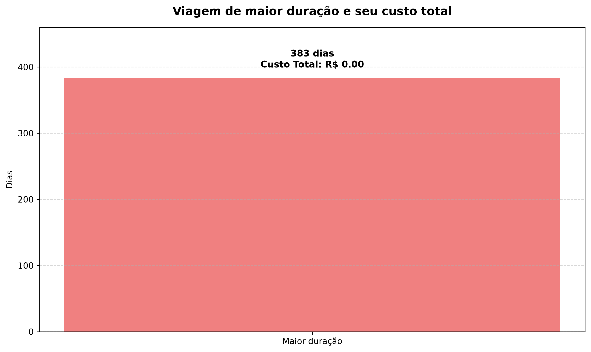

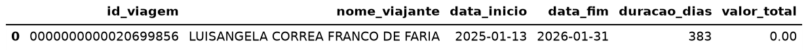

## 4. Qual o tipo de pagamento com maior valor médio?

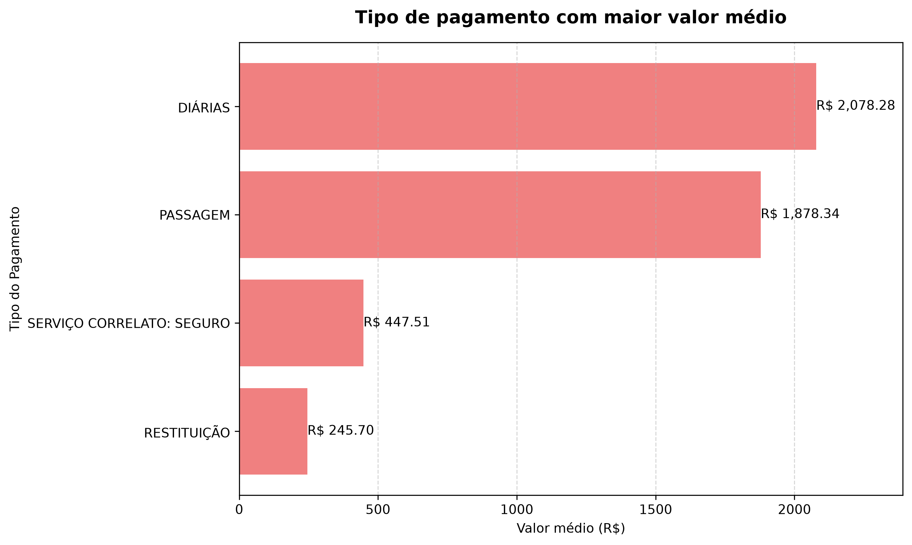

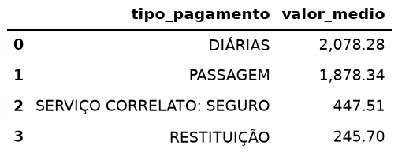

## 5. Qual o meio de transporte mais usado nos trechos?

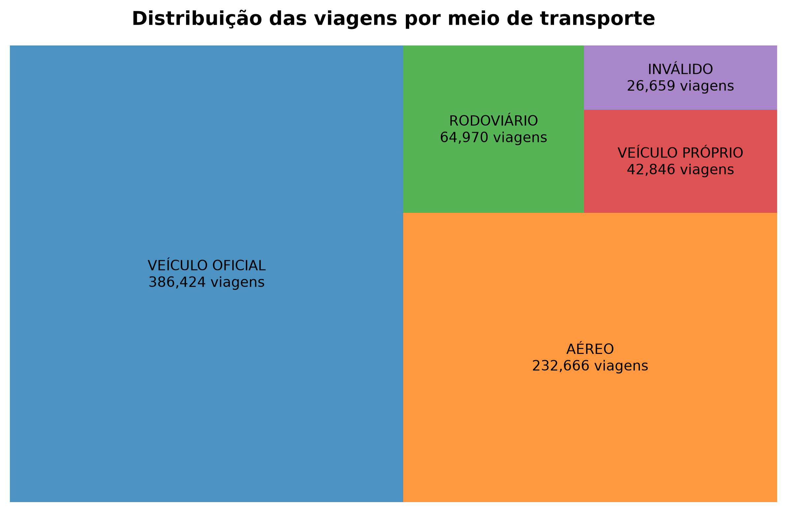

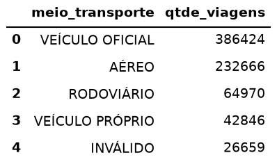

## 6. Qual UF de destino aparece em mais trechos?

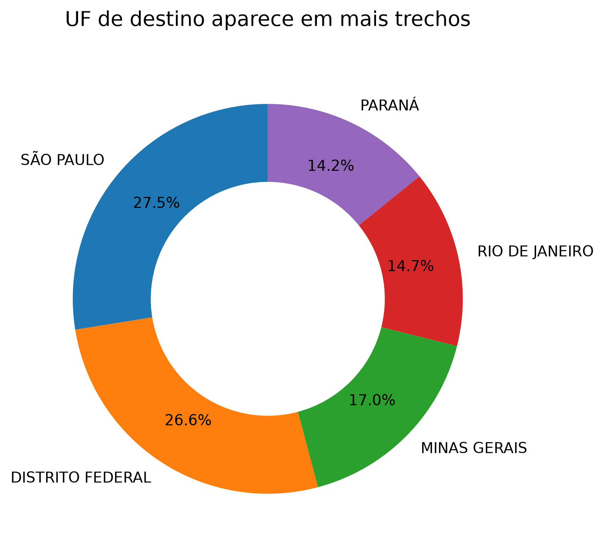

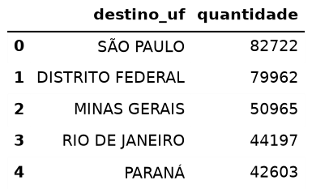

## 7. Qual órgão pagou mais no total?

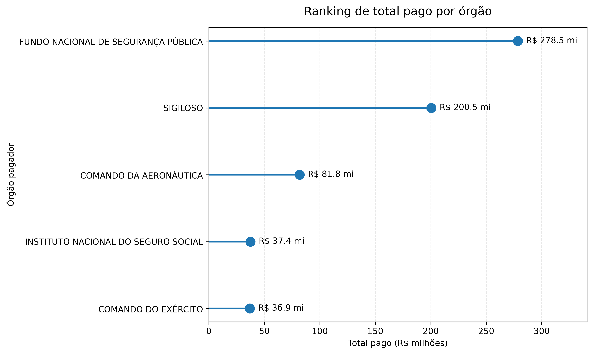

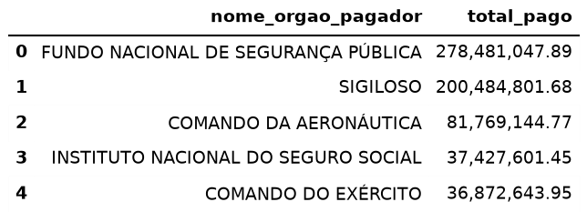

## 8. Qual meio de transporte possui maior custo medio viagem?

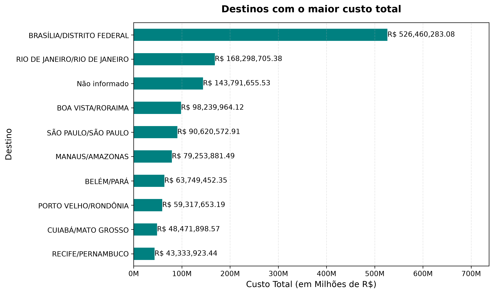

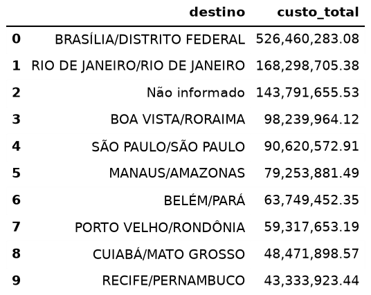

## 9. Destinos com maior custo total


## 10. Viajantes com maior custo total

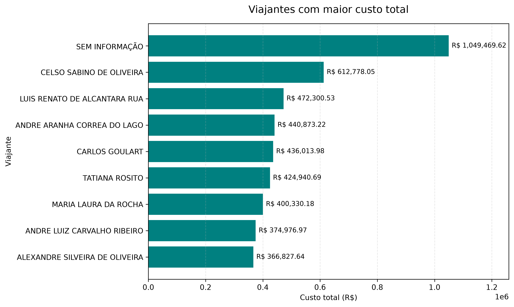

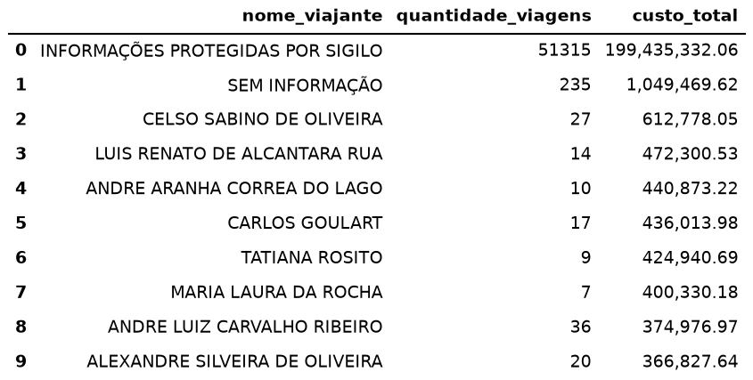


